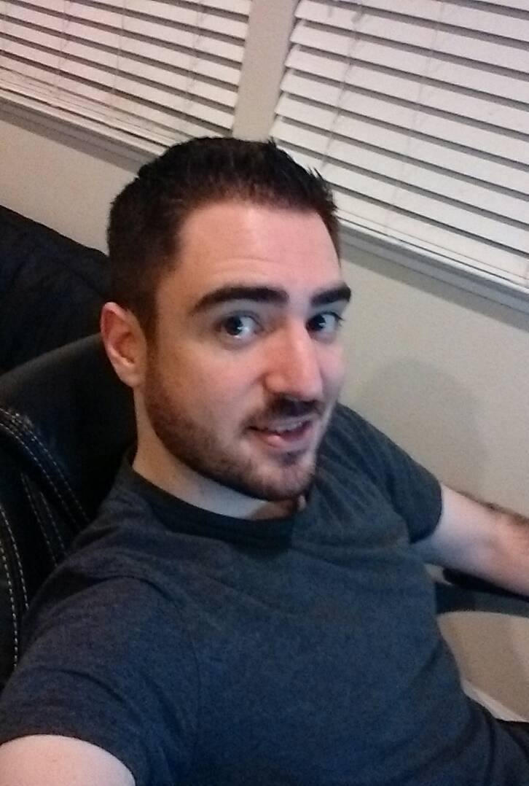

# What is this?

&nbsp;&nbsp;&nbsp;&nbsp;&nbsp;&nbsp;Hey there! you stumbled onto this web cave of weird projects and fancy tales. If you are like me then you must enjoy and appreciate the nitty gritty of reconfigurable hardware, reverse engineering and the middle world of SW<->HW interaction. I know some of you may not be experts in FPGAs (certianly I don't feel like I'm there yet) but I hope that the posts on this site will help you on your journey. Feel free to stay, look around and comment on my twitter [@defparam](https://twitter.com/defparam) or feel free to browse a library of incomplete projects on my [github](https://github.com/defparam).

Enjoy!

# Who am I?

 

&nbsp;&nbsp;&nbsp;&nbsp;&nbsp;&nbsp;My name is Evan Custodio. During the day I am an FPGA Architect for Intel Corporation. I help architect and pathfind next generation FPGA architectures in the datacenter. I have over 10+ years of FPGA experience in production deployments. I have worked at Altera Corp (Now Intel PSG) for half that time learning the internals of how FPGAs work. Reconfigurable Hardware, Debug and Security are my major interests. I hold 3 patents in this area and have another 10+ pending.

### Patents:

* [Programmable logic device virtualization](https://patents.google.com/patent/US20180076814A1)
* [Methods and apparatus for performing partial reconfiguration in a pipeline-based network topology](https://patents.google.com/patent/US20180081840A1)
* [Serial architecture for high assurance processing](https://patents.google.com/patent/US20110213984A1)

### Publications:

* [Self-Healing Partial Reconfiguration of an FPGA](https://web.wpi.edu/Pubs/E-project/Available/E-project-042607-133123/unrestricted/GD_D07_MQP_final_draft.pdf)

&nbsp;&nbsp;&nbsp;&nbsp;&nbsp;&nbsp;I recieved my Bachelors in Electrical and Computer Engineering from Worcester Polytechnic Institute (Class of 2007) and my Masters as well (Class of 2009). Since school I have worked on highspeed datapaths and cryptography on FPGA. I have experience in network and media based protocols (TCP/IP, Infiniband, RDMA, SATA, SCSI, 10Gb/40Gb/100Gb Ethernet and PCIe) and most recently my experience has been focused around Partial Reconfiguration for Arria 10 and Stratix 10 FPGAs in accelerator based frameworks.

Here is my [LinkedIn profile](https://www.linkedin.com/in/evan-custodio-b7026550/)

&nbsp;&nbsp;&nbsp;&nbsp;&nbsp;&nbsp;When I'm not working I enjoy my hardware-based hobbies working on personal projects involving retro-videogaming, security and reversing engineering. When I'm not at a computer I mostly enjoying speading time with my loving girlfriend, family, friends and hiking.
